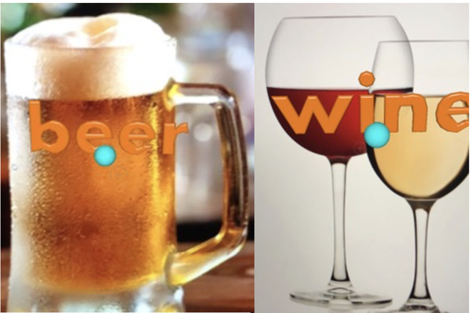

# BoozeML

BoozeML is a Core ML model we created during WWDC18 using Create ML to classify drinks as beer, wine, or nonalcoholic. We took hundreds of photographs of the drinks everyone had in hand at AltConf and created a machine learning model using the new tools! 

This model has successfully classified tons of test data, including beer and water in a wine glass.
